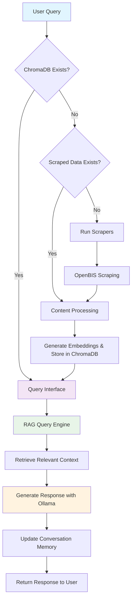

# DeSi: DataStore Helper

[](https://www.python.org/downloads/)
[](https://opensource.org/licenses/MIT)
[](https://github.com/carlosmada22/DeSi/issues)
[](https://github.com/carlosmada22/DeSi/stargazers)

DeSi (DataStore Helper) is an intelligent RAG-focused chatbot that provides expert assistance for openBIS and BAM Data Store documentation. It combines information from multiple knowledge sources using advanced retrieval-augmented generation techniques, powered by Ollama and ChromaDB.

## Table of Contents

- [DeSi: DataStore Helper](#desi-datastore-helper)
  - [Table of Contents](#table-of-contents)
  - [Features](#features)
  - [Architecture Overview](#architecture-overview)
  - [Workflow Diagram](#workflow-diagram)
  - [Prerequisites](#prerequisites)
    - [Required Ollama Models](#required-ollama-models)
  - [Installation](#installation)
    - [1. Clone the Repository](#1-clone-the-repository)
    - [2. Set Up Python Environment](#2-set-up-python-environment)
    - [3. Install Dependencies](#3-install-dependencies)
    - [4. Initialize Environment](#4-initialize-environment)
  - [Quick Start](#quick-start)
    - [🚀 One-Command Setup](#-one-command-setup)
    - [💬 Start Chatting](#-start-chatting)
    - [⚡ Advanced Usage](#-advanced-usage)
  - [Configuration](#configuration)
    - [Environment Variables](#environment-variables)
    - [Configuration File](#configuration-file)
  - [Usage](#usage)
    - [Command Line Interface](#command-line-interface)
    - [Available Parameters](#available-parameters)
    - [Individual Component Usage](#individual-component-usage)
  - [Project Structure](#project-structure)
  - [Components](#components)
    - [Scrapers](#scrapers)
    - [Processors](#processors)
    - [Query Engine](#query-engine)
    - [Conversation Engine](#conversation-engine)
  - [Example Queries](#example-queries)
  - [Development](#development)
    - [Running Tests](#running-tests)
    - [Adding New Scrapers](#adding-new-scrapers)
    - [Customizing Processing](#customizing-processing)
  - [Troubleshooting](#troubleshooting)
    - [Common Issues](#common-issues)
    - [Debugging](#debugging)
    - [Database Management](#database-management)
  - [Contributing](#contributing)
    - [Development Setup](#development-setup)
    - [Code Quality](#code-quality)
    - [Submitting Changes](#submitting-changes)
    - [Reporting Issues](#reporting-issues)
  - [License](#license)

## Features

- **Intelligent RAG Pipeline**: Advanced retrieval-augmented generation using Ollama and ChromaDB
- **Multi-Source Knowledge**: Combines openBIS ReadTheDocs and BAM Data Store Wiki.js documentation
- **Conversation Memory**: SQLite-based memory system maintains context across interactions
- **Smart Workflow**: Automatically handles scraping, processing, and database creation
- **Highly Configurable**: Environment-based configuration with sensible defaults
- **Source Prioritization**: Intelligently prioritizes relevant documentation sources
- **Interactive CLI**: Rich command-line interface with conversation history
- **Modular Architecture**: Clean separation of scraping, processing, and querying components

## Architecture Overview

DeSi follows a sophisticated multi-stage pipeline:

1. **Data Acquisition**: Web scrapers extract content from documentation sources
2. **Content Processing**: Documents are chunked, normalized, and embedded using Ollama
3. **Vector Storage**: ChromaDB stores embeddings for efficient similarity search
4. **Query Processing**: RAG engine retrieves relevant context and generates responses
5. **Conversation Management**: LangGraph-based engine maintains chat history and context

## Workflow Diagram



## Prerequisites

- **Python 3.8+** (3.10+ recommended)
- **Ollama** with required models installed
- **Git** for cloning the repository

### Required Ollama Models

DeSi requires two Ollama models to function:

```bash
# Install the embedding model (required for vector search)
ollama pull nomic-embed-text

# Install the chat model (default, can be configured)
ollama pull qwen3
```

> **Note**: You can use different models by configuring them in your `.env` file or via command-line parameters.

## Installation

### 1. Clone the Repository

```bash
git clone https://github.com/carlosmada22/DeSi.git
cd DeSi
```

### 2. Set Up Python Environment

It's highly recommended to use a virtual environment:

```bash
# Create virtual environment
python -m venv .venv

# Activate it
# On Windows:
.venv\Scripts\activate
# On Unix/macOS:
source .venv/bin/activate
```

### 3. Install Dependencies

Install DeSi with all dependencies:

```bash
# Install main package with development tools
pip install -e ".[dev]"
```

### 4. Initialize Environment

Run the setup script to verify prerequisites and create necessary directories:

```bash
python init.py
```

This script will:
- ✅ Check Python version compatibility
- ✅ Verify Ollama installation and models
- ✅ Create required data directories
- ✅ Run basic functionality tests

## Quick Start

### 🚀 One-Command Setup

The simplest way to get started is to run the main script, which handles everything automatically:

```bash
python main.py
```

This intelligent workflow will:
1. **Check** if ChromaDB database exists
2. **Scrape** documentation if no data is found
3. **Process** content and create embeddings
4. **Launch** the interactive CLI interface

### 💬 Start Chatting

Once the interface loads, you can ask questions like:
- *"How do I create a new experiment in openBIS?"*
- *"What are the steps to upload data to BAM Data Store?"*
- *"How do I configure user permissions?"*

### ⚡ Advanced Usage

```bash
# Force re-scraping even if data exists
python main.py --force-scraping

# Force re-processing even if database exists
python main.py --force-processing

# Skip scraping and use existing data
python main.py --skip-scraping

# Use custom configuration file
python main.py --config /path/to/custom.env
```

## Configuration

DeSi uses a flexible configuration system based on environment variables with sensible defaults.

### Environment Variables

Create a `.env` file in the project root to customize settings:

```bash
# Database Configuration
DESI_DB_PATH=desi_vectordb
DESI_COLLECTION_NAME=desi_docs
DESI_MEMORY_DB_PATH=data/conversation_memory.db

# Model Configuration
DESI_MODEL_NAME=qwen3
DESI_EMBEDDING_MODEL_NAME=nomic-embed-text

# Data Sources
DESI_OPENBIS_URL=https://openbis.readthedocs.io/en/20.10.0-11/index.html
DESI_WIKIJS_URL=https://datastore.bam.de/en/home
DESI_MAX_PAGES_PER_SCRAPER=100

# Processing Settings
DESI_MIN_CHUNK_SIZE=100
DESI_MAX_CHUNK_SIZE=1000
DESI_CHUNK_OVERLAP=50
DESI_RETRIEVAL_TOP_K=5
DESI_HISTORY_LIMIT=20

# Logging
DESI_LOG_LEVEL=INFO
```

### Configuration File

You can also specify a custom configuration file:

```bash
python main.py --config /path/to/your/config.env
```

## Usage

### Command Line Interface

The main interface is the intelligent CLI that handles the complete workflow:

```bash
# Standard usage - handles everything automatically
python main.py

# Advanced options
python main.py --help
```

### Available Parameters

| Parameter | Description | Example |
|-----------|-------------|---------|
| `--web` | Start web interface (currently uses CLI) | `python main.py --web` |
| `--skip-scraping` | Skip scraping even if no data exists | `python main.py --skip-scraping` |
| `--skip-processing` | Skip processing and go directly to query | `python main.py --skip-processing` |
| `--force-scraping` | Force scraping even if data exists | `python main.py --force-scraping` |
| `--force-processing` | Force processing even if database exists | `python main.py --force-processing` |
| `--config` | Path to custom configuration file | `python main.py --config custom.env` |

### Individual Component Usage

You can also run individual components separately:

```bash
# Run only the scraper
python -m desi.scraper.cli --url https://example.com --output data/raw/example

# Run only the processor
python -m desi.processor.cli --input data/raw --output data/processed

# Run only the query interface (requires existing database)
python -m desi.query.cli --db-path desi_vectordb
```

## Project Structure

```
DeSi/
├── 📁 src/desi/                    # Main source code
│   ├── 📁 scraper/                 # Web scrapers for documentation
│   │   ├── openbis_scraper.py      # OpenBIS ReadTheDocs scraper
│   │   └── cli.py                  # Scraper CLI interface
│   ├── 📁 processor/               # Content processing pipeline
│   │   ├── ds_processor.py         # DataStore Wiki.js processor
│   │   ├── openbis_processor.py    # OpenBIS content processor
│   │   └── cli.py                  # Processor CLI interface
│   ├── 📁 query/                   # RAG query engine
│   │   ├── query.py                # Core RAG implementation
│   │   ├── conversation_engine.py  # LangGraph-based chat engine
│   │   └── cli.py                  # Query CLI interface
│   ├── 📁 utils/                   # Utilities and configuration
│   │   ├── config.py               # Configuration management
│   │   └── logging.py              # Logging setup
│   └── 📁 web/                     # Web interface (Flask)
│       ├── app.py                  # Flask application
│       ├── cli.py                  # Web CLI interface
│       ├── 📁 templates/           # HTML templates
│       └── 📁 static/              # CSS, JS, images
├── 📁 tests/                       # Unit and integration tests
├── 📁 data/                        # Data storage
│   ├── 📁 raw/                     # Scraped raw content
│   │   ├── 📁 openbis/             # OpenBIS documentation
│   │   └── 📁 wikijs/              # Wiki.js content
│   ├── 📁 processed/               # Processed and chunked content
│   └── conversation_memory.db      # SQLite conversation history
├── 📁 desi_vectordb/               # ChromaDB vector database
├── 📁 prompts/                     # LLM prompt templates
│   └── desi_query_prompt.md        # Main query prompt
├── main.py                         # Main entry point
├── init.py                         # Environment setup script
├── pyproject.toml                  # Project configuration
└── README.md                       # This file
```

## Components

### Scrapers

**OpenBIS Scraper** (`src/desi/scraper/openbis_scraper.py`)
- Crawls ReadTheDocs documentation sites
- Converts HTML content to clean Markdown
- Handles navigation and link discovery
- Configurable page limits and filtering

### Processors

**DataStore Processor** (`src/desi/processor/ds_processor.py`)
- Processes Wiki.js content from BAM Data Store
- Intelligent content chunking and normalization
- Metadata extraction and enhancement

**OpenBIS Processor** (`src/desi/processor/openbis_processor.py`)
- Processes ReadTheDocs content
- Specialized chunking for technical documentation
- Source attribution and categorization

### Query Engine

**RAG Query Engine** (`src/desi/query/query.py`)
- ChromaDB-based vector similarity search
- Ollama integration for embeddings and generation
- Source prioritization logic
- Context-aware response generation

### Conversation Engine

**LangGraph-based Engine** (`src/desi/query/conversation_engine.py`)
- SQLite-based conversation memory
- Context maintenance across sessions
- Query rewriting and clarification
- Token counting and history management

## Example Queries

Try asking DeSi questions like:

- *"How do I create a new experiment in openBIS?"*
- *"What are the steps to upload data to BAM Data Store?"*
- *"How do I configure user permissions in openBIS?"*
- *"What is the difference between spaces and projects?"*
- *"How do I register a new collection in the data store?"*
- *"Can you explain the openBIS data model?"*

## Development

### Running Tests

DeSi includes comprehensive tests for all components:

```bash
# Run all tests
pytest

# Run with coverage
pytest --cov=src/desi

# Run specific test categories
pytest tests/test_scraper.py
pytest tests/test_processor.py
pytest tests/test_conversation_memory.py

# Run integration tests
python scripts/integration_test.py
```

### Adding New Scrapers

1. **Create scraper class** in `src/desi/scraper/`:
   ```python
   class MyCustomScraper:
       def __init__(self, base_url, output_dir):
           # Initialize scraper

       def scrape(self):
           # Implement scraping logic
   ```

2. **Add CLI support** in `src/desi/scraper/cli.py`
3. **Update main pipeline** in `main.py` to include the new scraper
4. **Add tests** in `tests/test_my_custom_scraper.py`

### Customizing Processing

Extend processors in `src/desi/processor/`:
- **Chunking strategies**: Modify chunk size and overlap parameters
- **Metadata extraction**: Add custom metadata fields
- **Content normalization**: Implement domain-specific cleaning
- **Embedding models**: Configure different Ollama models

## Troubleshooting

### Common Issues

| Issue | Solution |
|-------|----------|
| **Ollama not available** | Ensure Ollama is running: `ollama serve` |
| **Missing models** | Install required models: `ollama pull nomic-embed-text` |
| **Empty database** | Force re-processing: `python main.py --force-processing` |
| **Scraping fails** | Check internet connection and URL accessibility |
| **Memory issues** | Reduce chunk size in configuration |
| **Slow responses** | Check Ollama model performance, consider lighter models |

### Debugging

Enable detailed logging:

```bash
# Set log level in environment
export DESI_LOG_LEVEL=DEBUG
python main.py

# Or use configuration file
echo "DESI_LOG_LEVEL=DEBUG" > debug.env
python main.py --config debug.env
```

### Database Management

```bash
# Check database status
python -c "
from src.desi.utils.config import DesiConfig
from pathlib import Path
config = DesiConfig()
db_path = Path(config.db_path)
print(f'Database exists: {db_path.exists()}')
if db_path.exists():
    print(f'Database size: {sum(f.stat().st_size for f in db_path.rglob("*") if f.is_file())} bytes')
"

# Reset database (removes all data)
rm -rf desi_vectordb/
python main.py --force-processing
```

## Contributing

We welcome contributions! Here's how to get started:

### Development Setup

1. **Fork and clone** the repository
2. **Create a virtual environment** and install dependencies:
   ```bash
   python -m venv .venv
   source .venv/bin/activate  # On Windows: .venv\Scripts\activate
   pip install -e ".[dev]"
   ```
3. **Run tests** to ensure everything works:
   ```bash
   pytest
   python scripts/integration_test.py
   ```

### Code Quality

We use several tools to maintain code quality:

```bash
# Format code
ruff format src tests

# Lint code
ruff check src tests

# Type checking
mypy src

# Run all checks
pytest && ruff check src tests && ruff format --check src tests
```

### Submitting Changes

1. **Create a feature branch**: `git checkout -b feature/your-feature-name`
2. **Make your changes** and add tests
3. **Run the full test suite**: `pytest`
4. **Submit a pull request** with a clear description

### Reporting Issues

- **Bug reports**: Include steps to reproduce, expected vs actual behavior
- **Feature requests**: Describe the use case and proposed solution
- **Questions**: Use GitHub Discussions for general questions

## License

This project is licensed under the MIT License. See the [LICENSE](LICENSE) file for details.

---

**DeSi** - Making openBIS and BAM Data Store documentation accessible through intelligent conversation.
