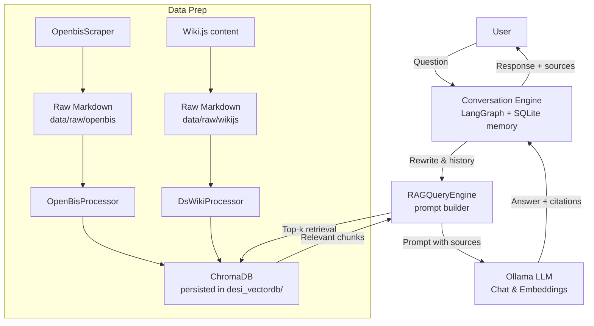

# Architecture

DeSi is organized as a staged pipeline plus conversational interface:

- **Scraper** (`desi.scraper.openbis_scraper.OpenbisScraper`): crawls ReadTheDocs/Wiki.js pages and stores Markdown in `data/raw/**`.
- **Processors** (`DsWikiProcessor`, `OpenBisProcessor`): clean, chunk, and embed content; exports artifacts under `data/processed/**` and persists embeddings to `desi_vectordb/`.
- **RAG Engine** (`RAGQueryEngine`): loads ChromaDB, retrieves relevant chunks, and constructs prompts with boosted scores for DataStore content.
- **Conversation Layer** (`ChatbotEngine` + `SqliteConversationMemory`): LangGraph graph rewrites follow-up questions, calls the RAG engine, and records history in SQLite.
- **Interfaces**: terminal CLI (`python main.py` or `python -m desi.query.cli`) and FastAPI/Gradio (`python -m desi.web.cli`) backed by the same conversation engine.

The main orchestration (`main.py`) wires these pieces together, skipping stages when artifacts already exist unless forced via CLI flags.
